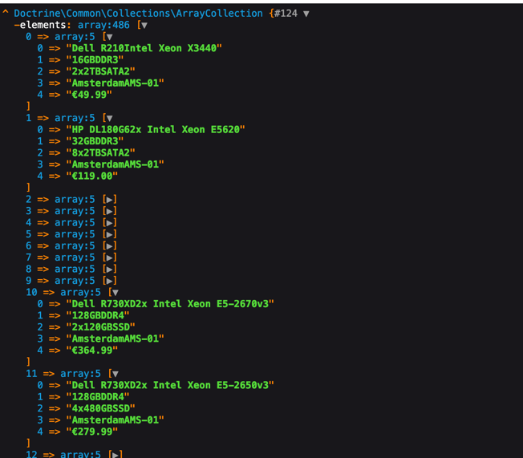
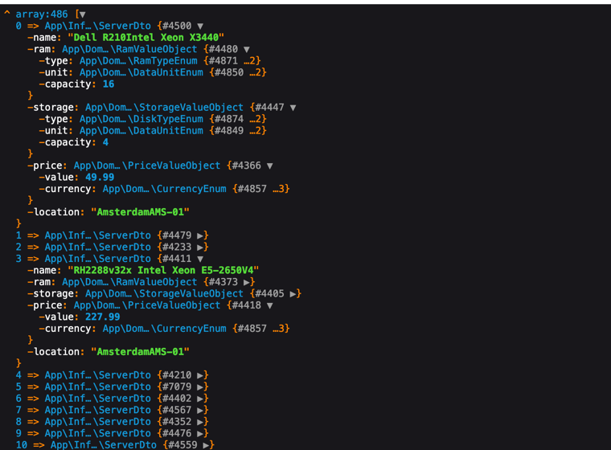
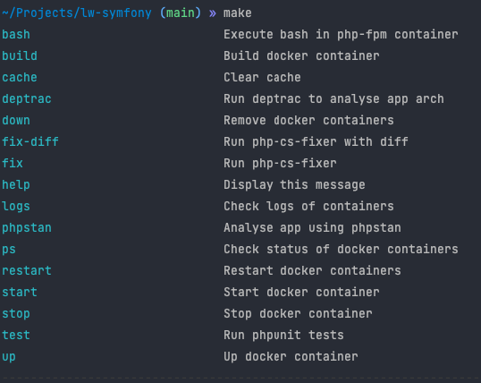

# Lease web

### Data from excel

#### Parsed data

### Supported commands

### Roadmap

- [x] Create a symfony project;
- [x] Install necessary dependencies;
- [x] Docker support;
- [x] Implement Price parser;
- [x] Implement Disk parser;
- [x] Implement Ram parser;
- [x] Create an adapter to _phpspreadsheet_;
- [x] Read values from xlsx file;
- [x] Create Server DTO;
- [x] Make support;

### TODO

- [ ] Unit tests using phpunit;
- [ ] Feature tests with @_dataProviders_;
- [ ] Implement Disk parser;
- [ ] Search for duplicates;
- [ ] Configure deptrac;
- [ ] Use Semantic release;
- [ ] Expose API using _REST_ / _GraphQL_;
- [ ] Reorganize structure of the project (now is using kind of DDD);
- [ ] **DDD is too much overkill for a project of this size** none of the concepts of DDD was applied Ubiquitous language, Boundaries, Context Boundary, Domains, etc...(only Value Objects, and half of structure);
  - [ADR](https://en.wikipedia.org/wiki/Action%E2%80%93domain%E2%80%93responder) arch is good for this project or MVC;
- [ ] Implement OpenAPI Support;
- [ ] Implement a frontend using vue and bulma maybe;
- [ ] Dependency injection using interfaces (IoC);
- [ ] Make use of the iterators the perfomance impact is not that much but it provides a better interface to deal with data like this;
- [ ] Implement filters using a Builder pattern and lazy collections;
- [ ] Configure [OPCache PHP Preload](https://www.php.net/manual/en/opcache.preloading.php)
- [ ] Enable [PHP JIT](https://php.watch/versions/8.0/JIT)
- [ ] Deploy this project to a cloud provider using Semantic release;
- [ ] Apply API versioning;
- [ ] Make Http Handler Exception; 

### Ideas

- Change `phpoffice/phpspreadsheet` to [openspout](https://github.com/openspout/openspout) lib.
  - **openspout** uses streams not all content is load in memory like phpspreadsheet (only one cell is loaded in memory `$iterator->current()`)
- Use some type of cache (Redis, MEMCache) to store the servers info or make the phpspreadsheet use batches so consumes less memory;
  - make a md5 hash of file (so we know that the info as not change, all can be cached)
- Implement k8s;
- Since the scope/domain of this project is small - Reduce the arch of the project;
- Implement CI/CD pipelines (Lint, Tests, Automatic deploys);
- Implement Rate Limiting;
- Use varnish for cache;
- ~~Use this as microservice?;~~
- Use RabbitMQ to update current values;
- Use gRPC / Protobufs (if the performance is not good or issues with inconsistent data)

